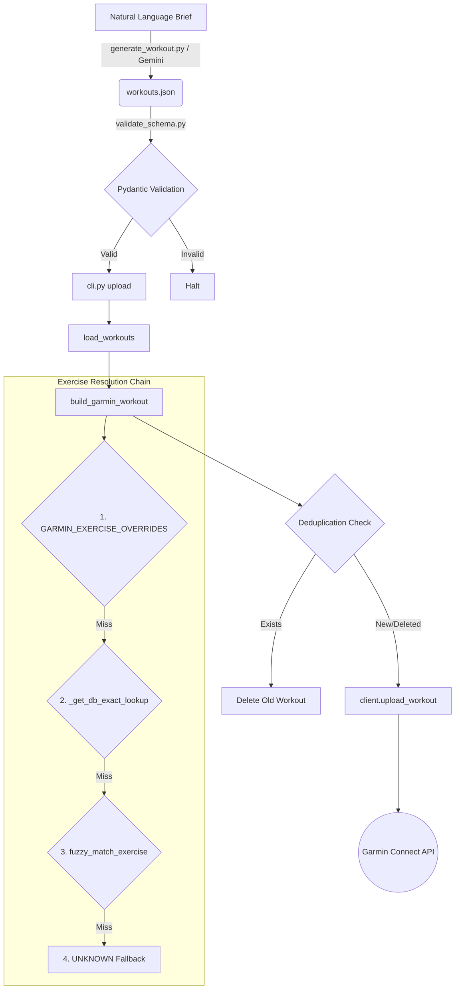

# Garmin Integration — Domain Driven Design (DDD) & Project Specification

## 1. Project Overview

**Purpose:** Upload structured strength training workouts to Garmin Connect via their unofficial REST API.
**User:** Erik.
**Fitness Context:** Follows a weekly 4-day split strength training program (Beach Body 2026). Has a left shoulder injury constraint (no heavy overhead pressing, safe exercises include landmine press, floor press, face pulls, lateral raises ≤RPE7).
**Tech Stack:** Python 3.11, `garminconnect` (unofficial API wrapper), `pydantic` (schema validation), `typer` (CLI), `google-generativeai` (workout generation from natural language).

---

## 2. Domain Model

- **Training Program:** A long-term fitness goal divided into weeks and phases.
- **Phase:** Macrocycle state. Supported values: `PEAK`, `VOLUME`, `DELOAD`.
- **Workout:** A single day's session (e.g., "Trening A", "Trening B"). Can be active or `omitted` (e.g., active rest).
- **Exercise:** A specific movement (e.g., "Goblet Squat"). Contains sets, reps, weight (in kg), and notes.
- **EMOM (Every Minute on the Minute):** A cardio finisher format. Represented via `format: "EMOM"`, translated as sets=minutes and reps=reps_per_minute.
- **Superset:** Grouping two consecutive exercises to be performed back-to-back. Represented by `superset_with_next: true` on the first exercise.

---

## 3. Architecture Diagram



---

## 4. File Glossary

- **`cli.py`**: Unified entry point using `typer`. Provides commands to upload, validate, probe, generate, and verify.
- **`garmin_uploader.py`**: The core engine. Loads JSON, resolves exercises via a 4-step chain, builds the proprietary Garmin `RepeatGroupDTO` payloads, handles OAuth, deduplication, rate limits (exponential backoff), and uploads.
- **`models.py`**: Pydantic v2 models for `WorkoutsFile`, `Workout`, and `Exercise`. Used for runtime validation and as the strict JSON schema for the LLM.
- **`generate_workout.py`**: Calls Gemini 2.5 Pro with a training brief to generate a structurally valid `workouts.json` adhering to Garmin keys and user injury constraints.
- **`validate_schema.py`**: Offline schema validator. Uses Pydantic if available, otherwise falls back to a robust manual validation suite.
- **`workouts.json`**: The canonical source of truth for the current week's training. Hand-written or AI-generated.
- **`garmin_exercises_db.json`**: Cached database mapping over 115 human-readable exercise names/aliases to valid Garmin `category` and `exerciseName` keys.
- **`test_garmin_uploader.py`**: Comprehensive unit test suite (17 tests) using mocked APIs. Ensures building, deduplication, retry logic, and validation remain intact.
- **`verify_garmin_upload.py`**: End-to-end integration test. Uploads, fetches back, diffs, and cleans up test workouts on the live API.
- **`.github/workflows/ci.yml`**: GitHub Actions pipeline that runs tests, validators, and alias duplicate checks on every push/PR.
- **`requirements.txt`**: Pinned dependency list.

---

## 5. Exercise Resolution Chain

To convert "Počep" or "Face Pulls" to Garmin's specific internal ENUMs, `garmin_uploader.py` uses a 4-step chain:

1. **`GARMIN_EXERCISE_OVERRIDES`**: Hardcoded O(1) Python dict. Used for semantic remaps (e.g., "Curl" -> "PULL_UP/CHIN_UP") or rapid fixes.
2. **`_get_db_exact_lookup()`**: O(1) exact string match against all aliases defined in `garmin_exercises_db.json`.
3. **`fuzzy_match_exercise()`**: Difflib-based fuzzy matching (cutoff=0.6) against the DB aliases. Handles typos and minor variations (e.g., "Goblet KB" -> "SQUAT/GOBLET_SQUAT").
4. **`UNKNOWN` Fallback**: If all fail, the exercise is uploaded as category `UNKNOWN` with no specific `exerciseName`. Logs a warning.

---

## 6. Garmin API Contract

Garmin's API expects a highly specific, proprietary nested JSON structure.
Key structural rules:
- Workouts contain `workoutSegments`, which contain `workoutSteps`.
- Sets are wrapped in a `RepeatGroupDTO` step.
- Inside the RepeatGroup, there are `ExecutableStepDTO` objects representing the actual exercise (interval) and the intra-set rest.
- **GOTCHA (Weight in Grams):** The `weightValue` must be in grams (`weight_kg * 1000.0`). The unit is explicitly passed as `{"unitKey": "kilogram", "factor": 1000.0}`.
- Consecutive standalone exercises are separated by a rest step (default 120s) mapped via `between_exercise_rest`.

---

## 7. workouts.json Schema Reference

```json
{
  "week": 6,
  "phase": "VOLUME",
  "notes": "General phase focus notes...",
  "schedule": {
    "Monday": "Trening A", 
    "Tuesday": "REST"
  },
  "workouts": [
    {
      "id": "trening_a",
      "name": "Trening A (Push)",
      "omitted": false,
      "between_exercise_rest": 120.0,
      "exercises": [
        {
          "name": "Goblet Squat",
          "sets": 3,
          "reps": 8,
          "weight_kg": 16.0,
          "notes": "RPE 7",
          "superset_with_next": true,
          "format": null
        }
      ]
    }
  ]
}
```
*Notes on fields:* `weight_kg` must be float or null. `superset_with_next: true` merges this and the following exercise into a single RepeatGroup. Omitted workouts require `type` and `notes`.

---

## 8. Week Lifecycle

**A. Manual Flow:**
1. Edit `workouts.json` by hand.
2. Run `python cli.py validate` offline.
3. Run `python cli.py upload` to sync to Garmin.

**B. AI-Assisted Flow:**
1. Formulate a brief: "Week 7, shift to PEAK phase, lower reps, higher weight."
2. Run `python cli.py generate --brief "..." --week 7 --phase PEAK`.
   - The script archives the old week to `history/`.
   - Calls Gemini to generate new JSON.
   - Pydantic validates the AI output.
3. Review `workouts.json`.
4. Run `python cli.py upload`.

---

## 9. Configuration Reference

- **`.env` variables**:
  - `GARMIN_EMAIL`: Account email.
  - `GARMIN_PASSWORD`: Account password.
  - `GEMINI_API_KEY`: Google Gemini API key for `generate_workout.py`.
- **Token Store**: `.garmin_tokens/` directory caches OAuth tokens to bypass 2FA after initial login.
- **Default Constants**: `PAGE_SIZE = 100` (API fetching), `base_delay = 30.0` (rate limit backoff).

---

## 10. Test Strategy

- **Unit Tests (`test_garmin_uploader.py`)**: 17 tests. Fully mocked Garmin client (`MagicMock`). Tests payload building, DB parsing, superset encoding, fuzzy matching, omitted filtering, and rate-limit backoff.
- **Pydantic Tests (`test_garmin_uploader.py`)**: Validates model parsing and field coercion logic.
- **Integration Test (`verify_garmin_upload.py`)**: Hits the live Garmin API. Creates a dummy workout, fetches it, verifies structure, and deletes it. Run manually when updating `garminconnect` or suspecting API changes.

---

## 11. Known Limitations & Gotchas

- **Garmin Rate Limits:** Uploading rapidly triggers HTTP 429 Too Many Requests. The uploader uses exponential backoff (30s, 60s, 120s) to mitigate this.
- **Superset Encoding:** Garmin's API doesn't have a native "superset" tag. We emulate it by wrapping multiple interval steps (exercises) inside a single `RepeatGroupDTO`.
- **EMOM Approximation:** Garmin does not support EMOM directly. We map sets -> minutes and reps -> reps-per-minute. The `format: "EMOM"` tag is informational and logs a notice.
- **Deduplication Edge Cases:** `get_workouts` is paginated. If a user creates multiple workouts with the *exact same name*, the uploader deletes the first duplicate it finds, then uploads the new one.

---

## 12. Future Roadmap

- **Analytics:** Export completed workout telemetry from Garmin to track volume/tonnage progression over the weeks.
- **Web UI:** Build a lightweight Streamlit/Gradio frontend for generating and editing `workouts.json` visually.
- **Biometrics Integration:** Pull sleep/HRV data to dynamically adjust the generated workout volume (e.g., force a DELOAD if recovery is poor).
